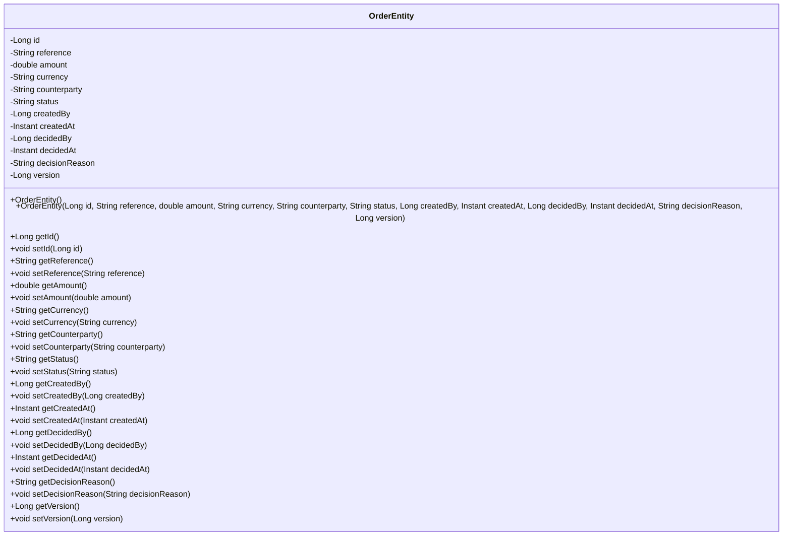
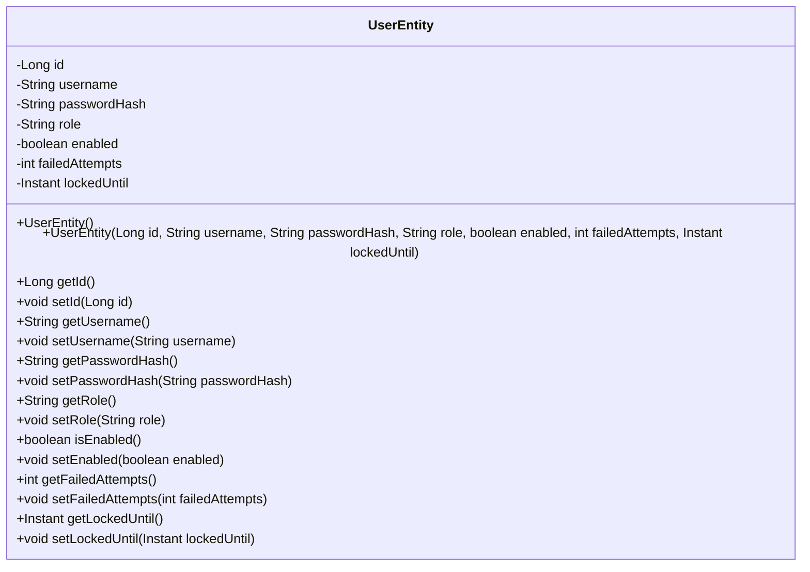

# SecureOrder Database Class Diagram

This diagram represents the JPA entities used for persistence in the SecureOrder application.
These entities map to the database tables and are part of the adapter.out.persistence layer.

## Entities

### OrderEntity
Maps to the `transactions` table (as per requirements).

### UserEntity
Maps to the `users` table (implied by the context).

## Relationships
Note: In the current implementation, there are no direct relationships defined between OrderEntity and UserEntity in the JPA layer (the foreign keys are just represented as Long fields). However, in the domain model, an Order is associated with a User (createdBy and decidedBy).

If we were to represent the relationships in the database, we would have:
- OrderEntity.createdBy -> UserEntity.id
- OrderEntity.decidedBy -> UserEntity.id (nullable)

But since we are focusing on the JPA entities as they are, we show them as separate classes without explicit relationships in this diagram.

## Notes
- The actual database table names are defined by the `@Table` annotation (OrderEntity uses "transactions").
- Column names are defined by the `@Column` annotation where specified.
- These entities are used by Spring Data JPA to interact with the PostgreSQL database.
- The domain layer (Order and User) is mapped to/from these entities by the persistence adapter.

---
*Generated as part of SecureOrder project documentation.*