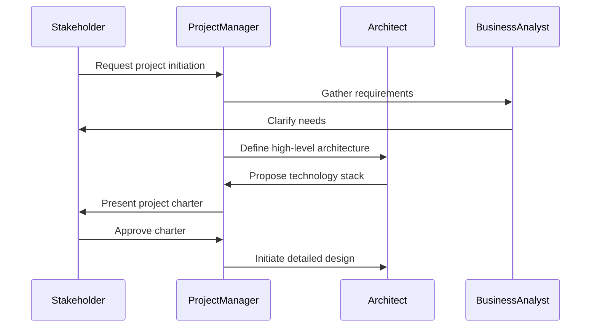
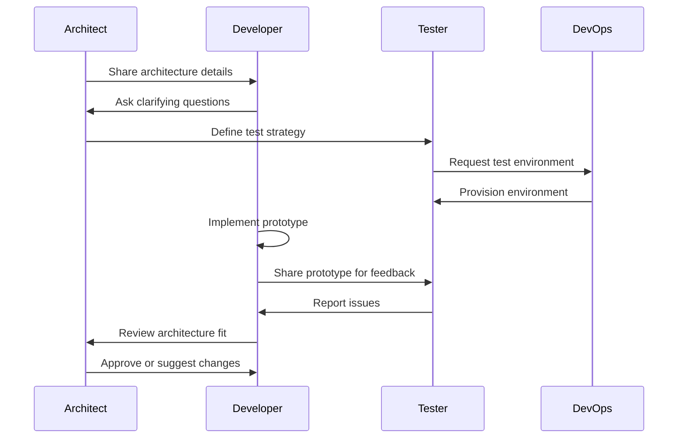
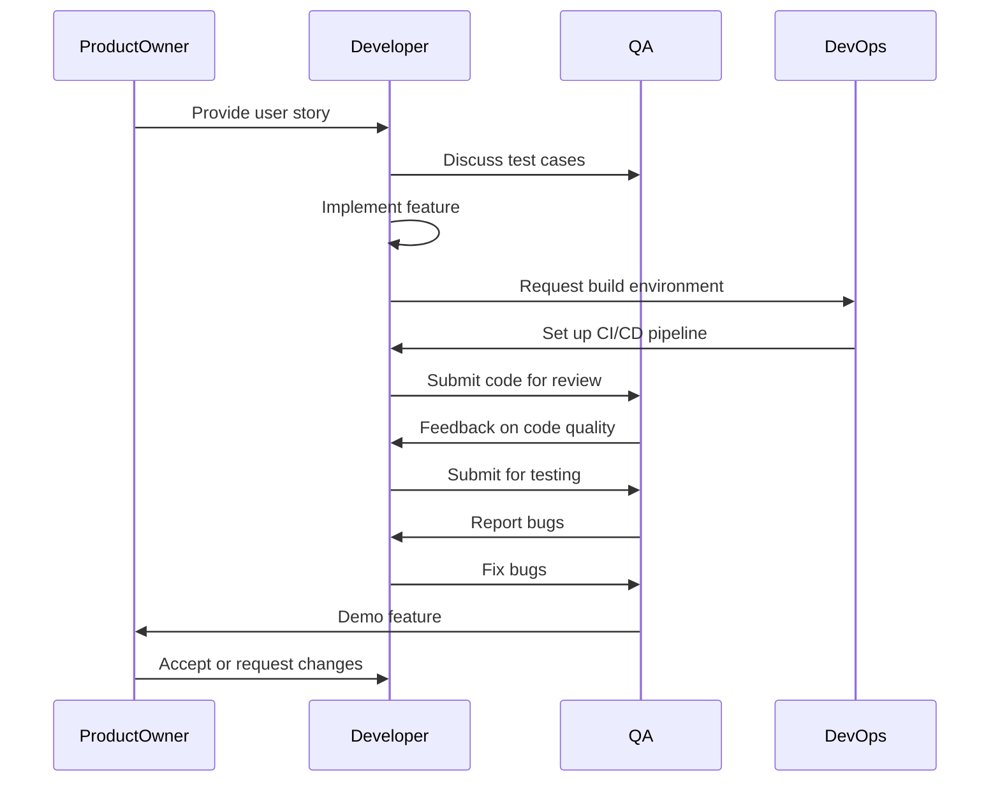
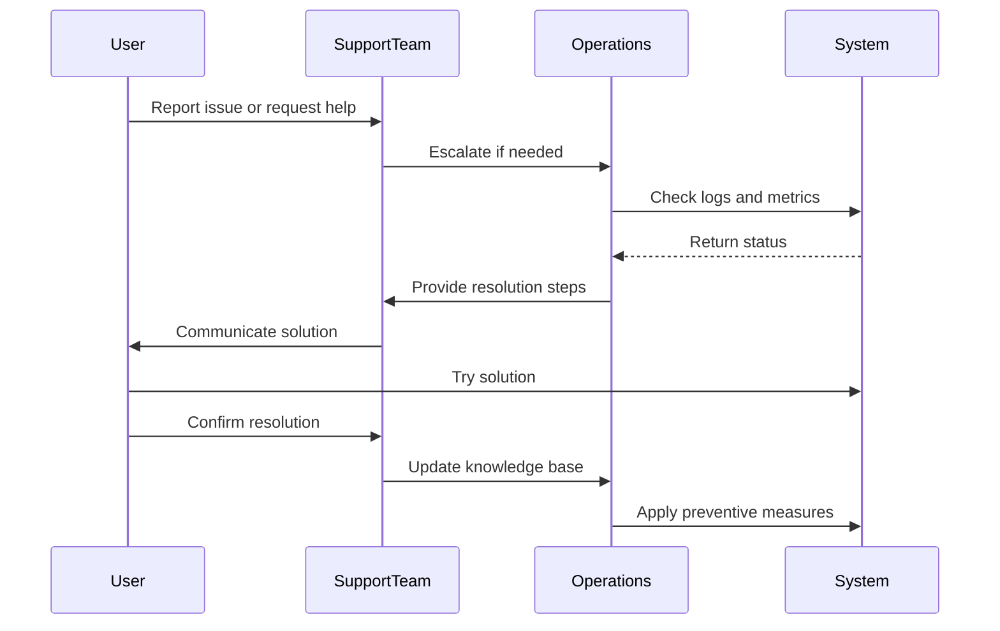
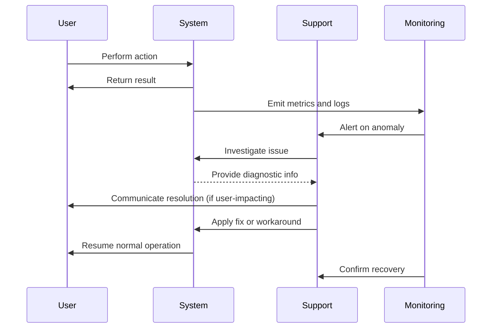

# SecureOrder Sequence Diagrams

This document contains sequence diagrams for each phase of the SecureOrder project.
We use Mermaid syntax to illustrate the interactions between different entities.

## Phase 1: Inception

## Phase 2: Elaboration

## Phase 3: Construction

## Phase 4: Transition

## Phase 5: Production

## Diagram Notes

- These diagrams are simplified representations of typical interactions.
- Actual diagrams should be tailored to specific scenarios within each phase.
- Use tools like Mermaid Live Editor or VS Code extensions to render these diagrams.
- Consider creating more detailed diagrams for critical user journeys or system interactions.

---
*Generated as part of SecureOrder project documentation.*